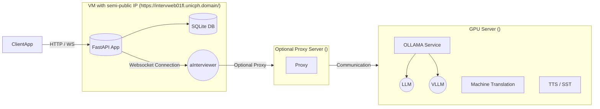

# Server communication

```mermaid
graph LR

subgraph VM ["VM with semi-public IP (https://intervweb01fl.unicph.domain/)"]
  FastAPIApp[("FastAPI App")]
  SQLiteDB[(SQLite DB)]
  FastAPIApp -- "Websocket Connection" --> ainterviewer(("aInterviewer"))
  FastAPIApp --> SQLiteDB
end

subgraph ProxyServer ["Optional Proxy Server ()"]
  Proxy
end

subgraph LocalServer2 ["GPU Server ()"]
  OLLAMAService["OLLAMA Service"]
  OLLAMAService --> LLM(("LLM"))
  OLLAMAService --> VLLM(("VLLM"))
  TranslationService["Machine Translation"]
  Audio["TTS / SST"]
end

ClientApp -->|HTTP / WS| FastAPIApp
ainterviewer -->|Optional Proxy| ProxyServer
ProxyServer -->|Communication| LocalServer2
```
